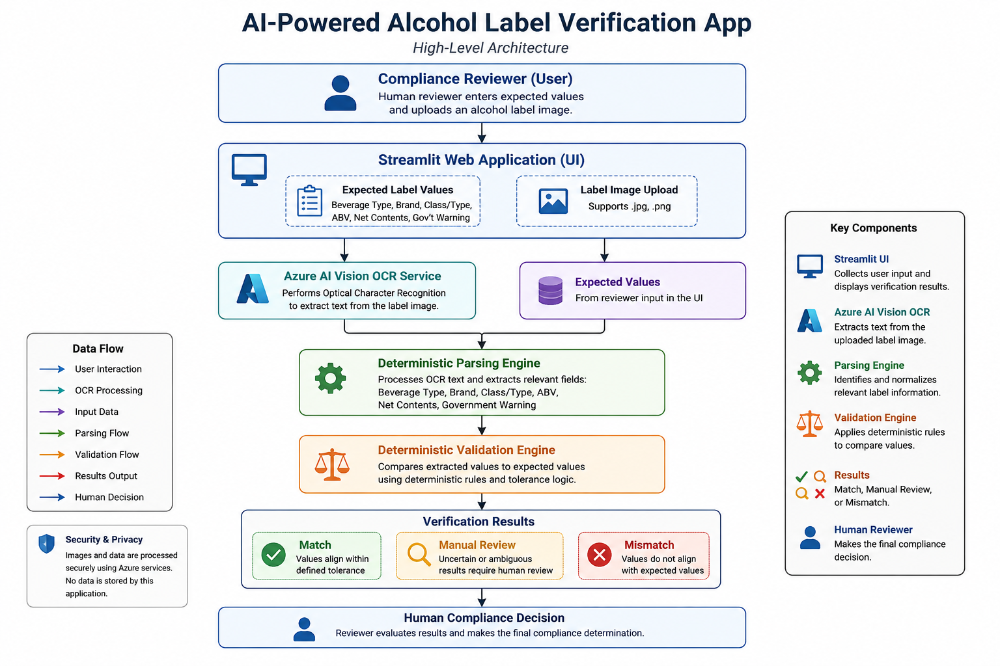

# AI-Powered Alcohol Label Verification App

**Take-Home Assessment for**  
**IT Specialist (Artificial Intelligence)**

**Status:** ✅ Complete Prototype  
**Language:** Python  
**Framework:** Streamlit  
**OCR:** Azure AI Vision  
**Tests:** ✅ 46 Passing

GitHub Repository:
<https://github.com/Talitha15/ttb-label-verifier>

Live Application:
<https://ttb-label-verifier-fuimaono.streamlit.app>

---
# Project Overview

This repository contains my submission for the IT Specialist (Artificial Intelligence) take-home assessment.

The project demonstrates a proof-of-concept application that assists label compliance reviewers by automating routine verification tasks using Azure AI Vision OCR and deterministic validation logic.

The application assists label compliance reviewers by comparing expected application values against text extracted from an uploaded alcohol label image.

Azure AI Vision is used to perform Optical Character Recognition (OCR), while deterministic validation rules compare the extracted values to the expected application data. The application reports each field as **Match**, **Manual Review**, or **Mismatch**, allowing a human reviewer to make the final compliance determination.

The goal of this prototype is to demonstrate how AI can improve review efficiency while maintaining transparency and human oversight.

---
# Background

The Alcohol and Tobacco Tax and Trade Bureau (TTB) reviews approximately 150,000 alcohol label applications each year. Stakeholder interviews identified opportunities to reduce manual data entry and improve consistency by automatically extracting label information before comparing it with the submitted application.

Rather than replacing compliance specialists, this prototype is designed to assist reviewers by automating repetitive comparison tasks and highlighting fields that require additional attention.

---
## Objectives

This prototype was designed to:

- Reduce repetitive manual verification performed by compliance agents.
- Improve consistency when comparing application data with label artwork.
- Preserve human oversight by routing uncertain cases to Manual Review.
- Demonstrate a practical AI-assisted workflow that could support future modernization efforts.

---
# Solution Overview
## Approach

The application follows a pipeline architecture:

User Input → Azure OCR → Field Parser → Validation Engine → Verification Results

The modular architecture is used to separate responsibilities and improve maintainability.

- Streamlit provides the user interface.
- Azure AI Vision performs OCR on uploaded label images.
- A parser extracts relevant TTB label fields from OCR output.
- A validation layer compares extracted values with user-provided expected values.
- Results are classified as Match, Mismatch, or Manual Review.

This allows OCR, parsing, and validation to evolve independently and makes the application easier to test and extend.

---
# Technology Stack

- Azure AI Vision
- Pillow
- pytest
- Python
- python-dotenv
- Streamlit

---
# System Architecture

The following diagram illustrates the high-level workflow of the application.



---
# Project Structure

```
app.py
src/
    extractor.py      # Azure OCR integration
    models.py         # Shared data models
    parsers.py        # Field extraction logic
    validators.py     # Validation rules
tests/
requirements.txt
README.md
```

---
# Installation

Install the required packages:

```bash
pip install -r requirements.txt
```

Create a `.env` file (or configure Streamlit Secrets when deploying) containing your Azure AI Vision endpoint and API key.

Run the application:

```bash
streamlit run app.py
```

Run the automated tests:

```bash
pytest
```

---
# Example Workflow

1. Enter the expected application values.
2. Upload an alcohol label image.
3. Click **Verify Label**.
4. Review the extracted values and validation results.
5. Use **Start New Verification** to begin another review.

---
# Design Decisions

When I planned this prototype, I wanted to keep the solution simple, transparent, and aligned with the stakeholder interviews.

Rather than allowing AI to make compliance decisions, I used Azure AI Vision only for OCR. All comparisons are performed using deterministic validation rules that produce consistent and explainable results. Any uncertainty is routed to **Manual Review**, allowing a compliance specialist to make the final determination.

I believe this approach provides a good balance between automation and accountability while keeping the application easy to understand, test, and maintain.

---
## Assumptions

This prototype assumes:

- Users enter the expected application values manually.
- Uploaded images contain a single alcohol label.
- Azure AI Vision successfully extracts readable text.
- Human reviewers remain responsible for final approval decisions, particularly for Manual Review cases.

---
## Limitations & Future Enhancements
### Current Limitations

This application was intentionally developed as a focused proof-of-concept to demonstrate AI-assisted label verification.

Current limitations include:

- OCR accuracy depends on the quality, orientation, and readability of the uploaded label image.
- The application requires internet connectivity to communicate with Azure AI Vision.
- Government Warning validation currently verifies the presence of the required warning statement. Exact typography (such as bold formatting and capitalization) is outside the scope of this prototype because OCR services primarily extract text rather than formatting.
- Images are processed individually. Batch processing of multiple labels was intentionally deferred to prioritize a stable, fully functional single-label workflow.

### Future Enhancements

Potential enhancements for a production-ready solution include:

- Batch upload and processing of multiple label images with associated application data.
- Exact validation of the complete Government Warning statement, including formatting requirements.
- Validation of additional TTB fields such as producer/bottler information and country of origin.
- Image preprocessing to improve OCR performance on skewed, low-light, or glare-affected photographs.
- Confidence scoring for extracted fields.
- Persistent audit logging and reporting of verification results.
- Integration with future COLA workflows once authorization and security requirements are defined.

---
# Lessons Learned

Building this project reinforced for me the importance of separating AI-assisted text extraction from business logic.

OCR can efficiently identify text on a label, but deterministic validation provides consistent and transparent comparisons against expected application data. Through testing across beer, wine, and distilled spirits labels, I found that routing uncertain cases to **Manual Review** produces more reliable behavior than trying to automate every edge case.

This experience also reinforced the value of designing AI solutions that assist people rather than replace them. For this proof of concept, keeping a human reviewer in the decision-making process felt like the most practical and responsible approach.

---
## Design Trade-Offs

Given the time-constrained nature of this prototype, development prioritized:

- Clean modular architecture
- Accurate core verification logic
- Simple user experience
- Reliable deployment

Rather than implementing production-scale capabilities such as database storage, batch processing, or direct integration with the COLA system.

These capabilities were intentionally deferred to maintain a stable and complete proof-of-concept.

---
## Testing

Unit tests were implemented using pytest to validate:

- Field extraction
- Parsing logic
- Brand matching
- Alcohol content detection
- Validation rules
- Edge cases

This helps ensure application behavior remains consistent as future enhancements are added.

---
## Technology Choices

Azure AI Vision was selected because it provides a managed OCR service without requiring custom model training. This allowed development effort to focus on parsing, validation logic, and user experience rather than optical character recognition itself.

Streamlit was selected because it enables rapid development of interactive Python web applications while keeping the prototype lightweight and easy to deploy.

---
# Acknowledgements

This prototype was developed as part of the TTB IT Specialist (Artificial Intelligence) take-home assessment and is intended solely as a proof of concept demonstrating the practical use of AI-assisted document verification.